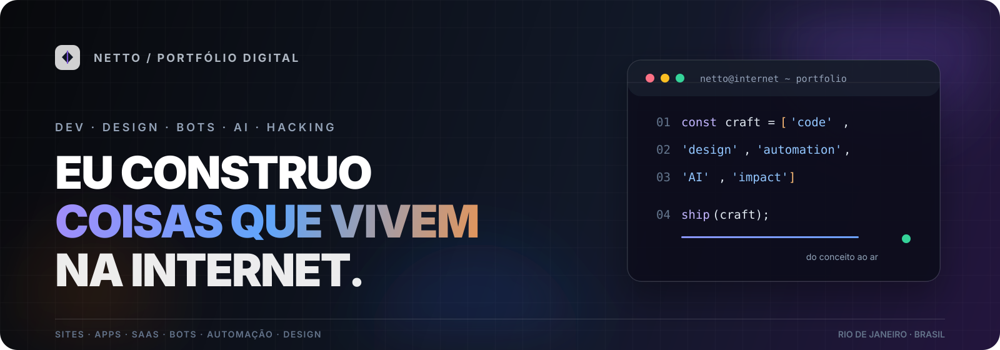

<div align="center">
  
</div>

<br />

<div align="center">
  <a href="https://github.com/netty-linux/portfolio"></a>
  <a href="https://github.com/netty-linux/portfolio"></a>
  <a href="https://github.com/netty-linux/portfolio"></a>
  
</div>

<br />

<h1 align="center">NETTO — Portfólio Digital</h1>

<p align="center">
  <strong>Eu construo coisas que vivem na internet.</strong><br />
  Sites, apps, designs, bots e automações para empresas, criadores e pessoas com uma boa ideia.
</p>

<p align="center">
  <a href="#o-que-eu-faco">O que eu faço</a> ·
  <a href="#estrutura">Estrutura</a> ·
  <a href="#rodando-localmente">Rodando localmente</a> ·
  <a href="#contato">Contato</a>
</p>

---

## Sobre o projeto

Este repositório contém o site pessoal e portfólio de **Netto** — um espaço para apresentar projetos, serviços, parcerias e formas de contato.

A proposta é simples: juntar **engenharia de software, design, inteligência artificial e automação** para transformar ideias em produtos digitais que realmente chegam ao ar.

> Uma experiência direta, visual e sem dependências desnecessárias: o site inteiro vive em um único `index.html` e em uma coleção de assets otimizados.

## O que eu faço

| Área | Entregas |
| --- | --- |
| **Web & produto** | Sites, landing pages, aplicações e SaaS |
| **IA & automação** | Agentes, bots, integrações e fluxos automatizados |
| **Design** | Interfaces, direção visual, branding e copywriting |
| **Cybersecurity** | Red team, hardening e orientação de segurança |
| **Conteúdo digital** | Produção musical, edição e experiências para creators |

## Destaques

- **+10 anos** criando para a internet
- **+1.000** beats, mixes e produtos vendidos
- **+1M** de visualizações no YouTube e Instagram
- Uma abordagem multidisciplinar: do conceito ao deploy

## Estrutura

```text
portfolio/
├── index.html              # Site completo: markup, estilos e conteúdo
├── assets/
│   ├── readme-banner.svg   # Banner deste README
│   ├── hero-retrato.png   # Imagem principal do hero
│   ├── sobre-foto.png      # Imagem da seção Sobre
│   ├── trabalho-*.png      # Galeria de trabalhos
│   ├── card-*.png          # Cards de clientes e parcerias
│   └── banner-crash.png    # Banner de projeto
└── README.md               # Documentação do projeto
```

## Rodando localmente

Não existe pipeline de build. Basta clonar o repositório e abrir o `index.html` no navegador.

```bash
git clone https://github.com/netty-linux/portfolio.git
cd portfolio
```

Para uma experiência mais próxima de produção, suba um servidor HTTP local:

```bash
python3 -m http.server 8000
```

Depois, acesse [http://localhost:8000](http://localhost:8000).

## Stack

<div>
  
  
  
  
  
</div>

- HTML semântico
- CSS puro com layout responsivo
- Google Fonts via `preconnect`
- SVG inline para ícones sociais
- Imagens lazy-loaded na galeria
- Compatível com deploy estático, incluindo Cloudflare Pages

## Princípios de design

- **Contraste:** preto, branco e tons neutros para manter o foco no trabalho.
- **Ritmo:** tipografia grande, espaçamento generoso e seções fáceis de escanear.
- **Performance:** zero dependências de build e carregamento sob demanda das imagens.
- **Responsividade:** grids que colapsam naturalmente em telas menores.

## Contato

Tem uma ideia? Vamos tirar do papel.

- **WhatsApp:** [fale comigo](https://wa.me/5521959552492)
- **Instagram:** [@netty.dev](https://www.instagram.com/netty.dev/)
- **GitHub:** [@netty-linux](https://github.com/netty-linux)

---

<div align="center">
  <sub>Feito do zero — do Figma pro ar.</sub>
</div>
